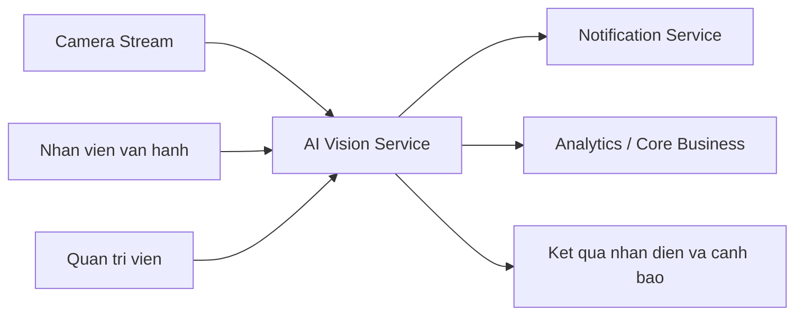

# Service Boundary của nhóm

## 1. Thông tin nhóm

- Tên nhóm:B4
- Lớp:CNTT 17-08
- Thành viên:Phạm Đức Duy Tiến - Vương Đức Tuấn - Dương Văn Việt
- Service nhóm phụ trách: AI Vision
- Sản phẩm tổng thể của lớp: Nền tảng mô phỏng hệ thống vận hành thông minh trong khuôn viên bệnh viện

## 2. Actor

Ai tương tác với hệ thống/service?

- Nhan vien van hanh/giu sat he thong
- Quan tri vien he thong
- Dich vu noi bo can ket qua phan tich anh

## 3. System Boundary

Nhóm em xây phần nào?

Phần nhóm kiểm soát: Xây dựng dịch vụ AI phân tích hình ảnh

- Xu ly anh dau vao va suy luan AI
- Tra ket qua phan tich/nhan dien

Phần nhóm chỉ tích hợp: 

- Camera Stream (nguon anh/video)
- Notification (gui canh bao)
- Analytics/Core Business (nhan du lieu phan tich)

## 4. Service Boundary

Service của nhóm có trách nhiệm gì?

- Nhan anh/luong anh va phan tich bang mo hinh AI
- Tra ket qua nhan dien/diem tin cay
- Cung cap API de dich vu khac goi

Service KHÔNG làm gì?

- Khong quan ly nguoi dung/phan quyen
- Khong luu tru anh goc lau dai
- Khong gui thong bao truc tiep den nguoi dung

## 5. Input / Output

### Input

- Anh hoac khung hinh tu luong camera
- Metadata (thoi gian, camera_id, khu vuc)

### Output

- Nhan/ket qua nhan dien
- Diem tin cay
- Thong tin canh bao (neu co)

## 6. API dự kiến

| Method | Endpoint | Mục đích |
|---|---|---|
| GET | /health | Kiểm tra service |
| POST | /analyze | Phan tich anh dau vao |

## 7. Phụ thuộc service khác

Service này gọi đến service nào?

- Notification (gui canh bao)
- Analytics/Core Business (luu/phan tich tiep)

Service nào gọi đến service này?

- Camera Stream (gui du lieu)
- Core Business

## 8. Sơ đồ minh họa

